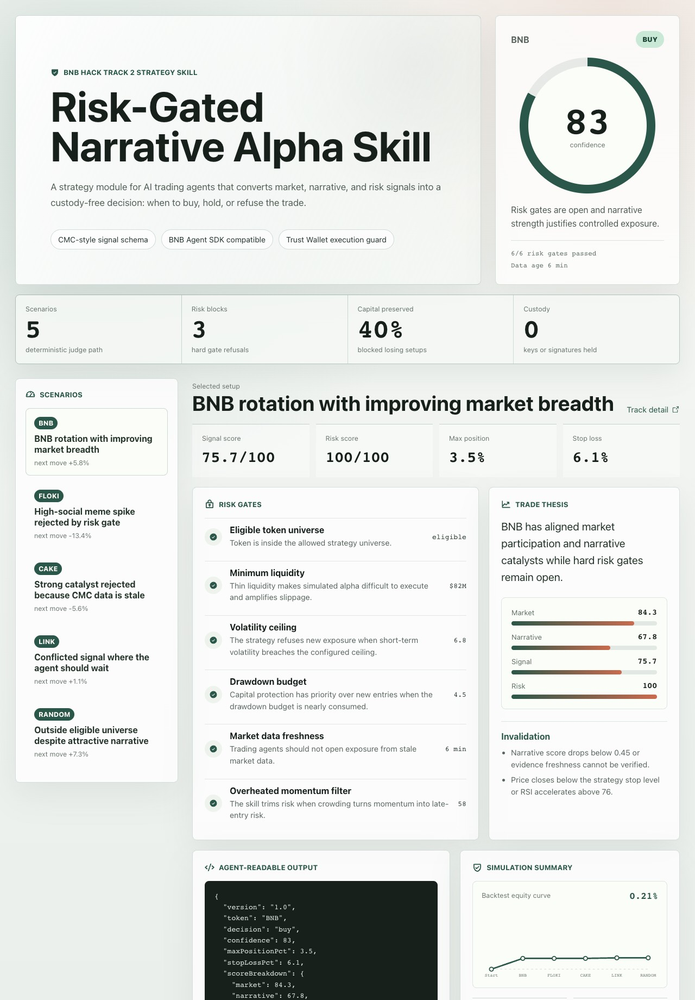

# Risk-Gated Narrative Alpha Skill

BNB Hack Track 2 submission: a strategy skill for AI trading agents that turns market, narrative, and portfolio-risk signals into a structured buy, hold, or avoid decision.



The skill is built around one practical idea: a trading agent should know when not to trade. Instead of returning a simple bullish or bearish label, it adds hard risk gates, position sizing, invalidation rules, and execution guards that downstream agents can read directly.

## Why this fits Track 2

- **Strategy Skill:** produces a reusable decision module that an AI trading agent can call before opening a position.
- **Real-world relevance:** focuses on drawdown control, liquidity, volatility, crowding, stale data, and custody boundaries.
- **CMC compatibility:** accepts CMC-style market and narrative inputs. The demo uses deterministic sample data so judges can run it without paid API keys.
- **Live-style CMC adapter:** includes a CMC Agent Hub payload normalizer in `src/integrations/cmcAgentHub.ts` plus `examples/cmc-agent-hub-payload.json`.
- **BNB Agent SDK compatibility:** exports plain TypeScript functions, stable JSON output, and `bnbAgentStrategyTool` for agent tool wrapping.
- **Trust Wallet compatibility:** returns execution guards only. It never stores keys, signs transactions, or executes trades by itself.

## What the skill does

For each token setup, the skill evaluates:

- Token universe eligibility
- Liquidity floor
- Volatility ceiling
- Portfolio drawdown budget
- Market data freshness
- Overheated momentum filter
- Market momentum, volume, RSI, and funding conditions
- News, social, KOL, and catalyst narrative quality

It returns:

- `buy`, `hold`, or `avoid`
- Confidence score
- Market, narrative, signal, and risk score breakdown
- Max portfolio allocation
- Stop loss and take profit guide
- Risk gate results
- Invalidation conditions
- Agent-readable JSON payload
- Deterministic backtest summary with equity curve and capital-preservation rate

## Run locally

```bash
npm install
npm run verify
npm run cli
npm run dev
```

Open the local URL printed by Vite. The demo lets judges switch between deterministic scenarios and inspect the exact JSON an agent would consume.

## Judge quick start

```bash
npm ci
npm run verify
npm run dev
```

Review `docs/judge-notes.md`, `submissions/skill-manifest.json`, and `examples/cmc-skill-response.json` for the strategy contract and agent response shape.

## Demo scenarios

- **BNB rotation with improving market breadth:** passes all gates and allows controlled exposure.
- **High-social meme spike:** rejects a crowded move because volatility, funding, and RSI indicate late-entry risk.
- **Stale catalyst feed:** rejects a strong narrative because the CMC-style market snapshot is too old.
- **Conflicted signal:** keeps the token on watch without opening a fresh position.
- **Outside eligible universe:** rejects a token even when the narrative looks attractive.

## Architecture

See `docs/architecture.md` for the integration diagram.

```text
src/core/types.ts        Shared input and output schema
src/core/strategy.ts     Scoring, gates, position sizing, JSON output
src/core/simulation.ts   Deterministic scenario runner and equity curve
src/data/scenarios.ts    Sample CMC-style market and narrative inputs
src/integrations/        CMC Skill, CMC Agent Hub, and BNB agent tool adapters
src/index.ts             Public package API for agent wrappers
src/ui/App.tsx           Interactive demo dashboard
src/cli.ts               Terminal demo for agent-readable output
```

## Agent integration sketch

```ts
import { bnbAgentStrategyTool, runCmcAgentHubSkill, runCmcSkill } from "bnb-track2-risk-skill";

const result = runCmcSkill(strategyInput);
const liveStyleResult = runCmcAgentHubSkill(cmcAgentHubPayload);
const agentToolResult = bnbAgentStrategyTool.execute(strategyInput);

if (result.output.decision === "buy") {
  // Pass result.output to a user-approved executor.
  // Recheck stale data and wallet permissions before any order.
}
```

## Submission artifacts

- `submissions/skill-manifest.json`: CMC Skill-style manifest for quick review.
- `examples/cmc-skill-response.json`: sample agent-readable response.
- `examples/cmc-agent-hub-payload.json`: live-style CMC Agent Hub payload fixture.
- `docs/integration-guide.md`: CMC, BNB Agent SDK, and Trust Wallet integration notes.
- `docs/architecture.md`: data flow and custody-boundary diagram.
- `docs/judge-notes.md`: concise review path for judges.
- `docs/submission-checklist.md`: final push, deploy, and DoraHacks checklist.
- `submissions/demo-script.md`: 2-3 minute demo video script.

## Current limitations

- Demo data is deterministic and simulated for judging accessibility.
- Live CMC Agent Hub data can replace `src/data/scenarios.ts` through the included payload adapter.
- The skill does not execute trades and does not provide financial advice.
- The skill does not custody funds, manage private keys, or sign transactions.

## Submission links

- DoraHacks track: https://dorahacks.io/hackathon/bnbhack-twt-cmc/detail
- CMC Agent Hub: https://coinmarketcap.com/api/agent
- BNB Agent SDK: https://github.com/bnb-chain/bnbagent-sdk
- Trust Wallet portal: https://portal.trustwallet.com
