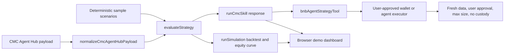

# Architecture

Risk-Gated Narrative Alpha Skill is split into a deterministic strategy core, thin adapters, and review artifacts. The strategy core has no wallet permissions and no network dependency.

## Boundaries

- `src/core/strategy.ts` contains scoring, risk gates, position sizing, invalidation, and agent-readable output.
- `src/core/simulation.ts` runs deterministic scenarios, computes outcome labels, and returns an equity curve for audit.
- `src/integrations/cmcAgentHub.ts` maps a live-style CMC Agent Hub payload into the strategy input schema.
- `src/integrations/cmcSkill.ts` returns the CMC Skill-style response and audit metadata.
- `src/integrations/bnbAgentTool.ts` exposes an analysis-only tool wrapper for BNB agent use.
- The project never stores keys, signs transactions, or sends orders.

## Review Flow

1. Run `npm run verify`.
2. Open the GitHub Pages demo or local Vite demo.
3. Select each scenario and inspect the risk gates, equity curve, and agent-readable JSON.
4. Inspect `examples/cmc-agent-hub-payload.json` and `src/integrations/cmcAgentHub.ts` to see how live CMC-style data enters the skill.
5. Inspect `src/integrations/bnbAgentTool.ts` to see the BNB agent wrapper contract.
